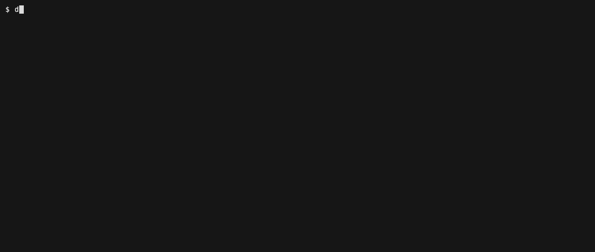

# Spike: replace yeschef's custom TUI with a multiplexer's native UI

**Status:** recommendation, backed by hands-on experimentation
**Recommendation:** **tmux**, moving line cooks from *session-per-ticket* to
*windows in one `yeschef` session*. `yeschef tui` collapses to `tmux attach`.
**Verdict on zellij:** no. **Verdict on keeping the custom TUI:** no.
**PoC:** [`poc/tui-native.sh`](poc/tui-native.sh) + [`poc/tui-native.tmux.conf`](poc/tui-native.tmux.conf) (runnable), demo GIF in the PR.

---

## TL;DR

The custom TUI (`src/commands/tui.rs`, ~960 lines) exists to do three things:
see each cook, get back to the head chef, and show per-cook status at a glance.
tmux already does all three natively — and the tmux **backend** just landed
(PR #21), so a tmux **frontend** is nearly free. Concretely:

- **One `yeschef` tmux session.** Head chef = window 0 (pinned, always
  `prefix+0` away). Each line cook = a window named `<project>-<branch>`.
- **The tmux status line *is* the brigade view** — one colour-coded tab per
  cook. A cook's self-reported status lives in a per-window user option
  (`@status`); a `window-status-format` renders it as a glyph + colour, updated
  **live** with zero polling and zero custom rendering.
- **`yeschef tui` becomes ~one line:** `tmux attach -t yeschef`. Navigation
  (`prefix+n/p/<number>`, `prefix+w` tree), the pinned head chef (`prefix+0`),
  and clean detach (`prefix+d`, back to your shell) are all stock tmux.

This **deletes** `src/commands/tui.rs` wholesale plus the `ratatui` / `vt100` /
`tui-term` dependencies and the `capture_pane_styled` / `capture_raw_styled`
backend methods (and the bare head-chef-session machinery). It also **simplifies
the backend**: the `TmuxBackend` "window" abstraction finally maps 1:1 onto real
tmux windows instead of the current "every window is secretly its own session"
indirection.

The one real change it asks for: line cooks stop being one-tmux-session-each and
become windows in a shared session. That trades a little isolation for the native
tab-bar. (Confirmed with the maintainer that session-per-ticket is *not* a hard
requirement.)

---

## What the TUI must do, and how tmux does each (all verified hands-on)

| Requirement | Custom TUI today | Native tmux |
|---|---|---|
| **1. See / switch between cooks** | ratatui sidebar list; `Enter` shells into `tmux attach` | The status-line tab bar; switch with `prefix+n`/`p`/`<number>`, or `prefix+w` for a searchable tree with live previews (built-in) |
| **2. Get back to the head chef** | pinned entry, `C` to jump | Head chef is window 0 → `prefix+0` (plus a `prefix+c` alias). Always one keystroke away |
| **3. At-a-glance status** | status column, re-derived from SQLite every tick, re-rendered by us | A colour + glyph per tab, driven by each window's `@status` option, re-rendered by tmux |
| *(detach — the reason we left zmx)* | shells out; relies on tmux's `Ctrl+b d` | Native `prefix+d`, returns cleanly to the shell |

Everything the custom TUI does *beyond* this table — the vt100 scrollback replay,
the pty-width clipping workarounds, the `PseudoTerminal` widget — is exactly the
"owning terminal rendering ourselves" maintenance sink we want gone. tmux owns
all of it.

---

## Recommended design

### Session / window model

```
tmux session "yeschef"  (on the private -L yeschef socket, -f <home>/tmux.conf)
├── window 0  headchef            @status=CHEF          ← pinned, prefix+0
├── window 1  proj-fix-auth       @status=IN_PROGRESS
├── window 2  proj-new-api        @status=DONE
├── window 3  proj-db-migrate     @status=BLOCKED
└── window 4  otherproj-flaky     @status=NEW
```

Today each ticket is its **own** tmux session `yeschef-<project>-<branch>`, and
the "brigade" is reconstructed by listing sessions with a `yeschef-` prefix
(`sid()` / `list_windows` in `backend/real.rs`). The trait pretends there are
windows; the backend fakes them with sessions. **The recommended model makes the
windows real:** one session, real windows. That is both what the native tab-bar
needs *and* a net simplification of the backend.

Backend delta (all on top of PR #21's tmux backend):

| Method | Today (session-per-ticket) | Recommended (windows-in-session) |
|---|---|---|
| `ensure_session` | no-op | `new-session -d -s yeschef -n headchef` + launch head chef as window 0 (idempotent) |
| `new_window` | `new-session -d -s yeschef-<w>` | `new-window -t yeschef: -n <w>` |
| `send_keys` / `capture_pane` | `-t yeschef-<w>` | `-t yeschef:<w>` |
| `list_windows` | list sessions, strip `yeschef-` prefix | `list-windows -t yeschef -F '#{window_name}'` (can now also report real `active`/`dead`) |
| `kill_window` | `kill-session -t yeschef-<w>` | `kill-window -t yeschef:<w>` |
| `attach` | `attach -t yeschef-<w>` | `attach -t yeschef` (optionally `select-window` first) |

Liveness is unchanged in spirit: a window closes when its agent process exits,
so a finished cook simply disappears from `list-windows` → surfaces as "gone",
exactly as today.

### Status → UI propagation (the interesting bit)

Line cooks already report status with
`yeschef ticket <project> <branch> status-set <STATUS>`
(→ `run_ticket_status_set` → SQLite). Add **one** tmux call next to the existing
SQLite write:

```sh
tmux -L yeschef -f <conf> set-window-option -t yeschef:<window> @status <STATUS>
```

`@status` is a per-window **user option**. yeschef's `tmux.conf` ships a
`window-status-format` that reads it and renders a coloured glyph — using tmux's
own conditional/compare format, no external process:

```tmux
set -g @glyph "#{?#{==:#{@status},CHEF},#[fg=magenta bold]★,#{?#{==:#{@status},DONE},#[fg=green]✓,#{?#{==:#{@status},BLOCKED},#[fg=red]■,#{?#{==:#{@status},IN_PROGRESS},#[fg=yellow]●,#[fg=colour244]○}}}}"
set -g window-status-format         "  #{E:@glyph} #[fg=colour250]#{window_name}  "
set -g window-status-current-format "#[bg=colour238]  #{E:@glyph} #[fg=white,bold]#{window_name}  #[default]"
```

`CHEF ★` magenta · `IN_PROGRESS ●` yellow · `DONE ✓` green · `BLOCKED ■` red ·
`NEW ○` grey. The tab-bar re-renders on every tmux event and every
`status-interval`, so an attached human sees a cook flip from yellow to green the
instant it reports `DONE`. **No polling loop, no redraw code on our side.** The
window *name* stays the stable ticket id (`<project>-<branch>`) and remains the
`send`/`peek`/`kill` target — status decoration lives entirely in `@status`, so
the two never collide.

This is the whole propagation mechanism and it is verified live in the PoC and
the demo GIF.

### Navigation & detach (stock tmux, no config needed)

- **Switch cooks:** `prefix+n` / `prefix+p` (next/prev tab), `prefix+<0-9>` (jump
  by index), `prefix+w` (interactive tree with live pane previews — best when
  there are many cooks).
- **Head chef:** `prefix+0` (window 0) — plus a one-line `bind c select-window
  -t :0` alias we ship.
- **Detach:** `prefix+d` → back to your shell, cleanly. This is the bug that
  motivated leaving zmx, and it's tmux's built-in.

`prefix` is `Ctrl+b` (tmux default; yeschef's config doesn't remap it).

### `yeschef tui` after this change

```rust
// was: 960 lines of ratatui/vt100 event loop
pub fn run_tui(config: &Config) -> Result<()> {
    config.tmux.ensure_session(yeschef_session())?; // head chef as window 0
    config.tmux.attach(yeschef_session(), None)      // hand over the terminal
}
```

---

## What this deletes

**Files**
- `src/commands/tui.rs` — the entire custom TUI (App state, ratatui event loop,
  `render_pane`'s vt100 replay + pty-width workarounds, `PseudoTerminal`, the
  head-chef pinning, and all their unit tests). Replaced by the ~3-line
  `run_tui` above (or folded into `run_attach`).
- `docs/tui-demo.tape` / `docs/tui-demo.gif` — the custom-TUI demo, superseded by
  the native one.

**Dependencies (`Cargo.toml`)**
- `ratatui = "0.30.2"`
- `vt100 = "0.16.2"`
- `tui-term = "0.3.4"`
- (`crossterm` too — it's only present transitively via ratatui.)

**Backend surface that exists *only* for the custom pane** (trait in
`backend/mod.rs`, impls in `real.rs` + `mock.rs`)
- `capture_pane_styled` — the `-e` styled capture + CRLF normalization, needed
  only to feed the vt100 parser.
- `capture_raw_styled` and the shared `capture_styled` helper.
- The bare head-chef-session machinery, now that head chef is a normal window 0:
  `ensure_raw_session`, `attach_raw`, and `names::headchef_session()`.

**Kept** (still used by `peek` / `status` / `spawn` / `send` / `kill` / `attach`):
`capture_pane` (plain), `send_keys`, `new_window`, `kill_window`, `list_windows`,
`window_exists`, `session_exists`, `ensure_session`, `attach`. Plus the whole
private-server model (`-L yeschef`, `-f <home>/tmux.conf`) and the Shift+Enter /
`extended-keys` config — all untouched.

**Added** (small): a `set_window_status` backend method (one `set-window-option`
call) invoked from `run_ticket_status_set`; the `window-status-format` block in
`tmux.conf`.

Net: **−~960 lines + 3 crates**, **+~15 lines of tmux config + one backend
method**, and a backend whose window abstraction stops lying.

---

## tmux vs zellij (both driven headlessly, not reasoned about)

The make-or-break property for yeschef is **headless orchestration**: yeschef
spawns sessions with no terminal attached, sends input, and captures output —
all without being a client. I drove both.

| | **tmux** | **zellij 0.44** |
|---|---|---|
| Detached spawn | `new-session -d` (native, ancient) | `attach --create-background` (new in 0.44; works) |
| Target a specific pane headlessly | `-t session:window` by **name** — stable, human-legible | by `pane_id` (`terminal_N`), assigned dynamically — yeschef must track the id per ticket |
| Send input | `send-keys -t <win> -l` | `action write-chars -p <pane_id>` |
| Capture output | `capture-pane -p -t <win>` (already used) | `action dump-screen -p <pane_id> [--ansi -f]` (works) |
| **Per-tab status colour** | **first-class** — `window-status-style` / a `@status`-driven format, per window | **not first-class** — tab styling is theme-global; you can rename a tab to embed a label, but there is no per-tab colour CLI. Weaker "at a glance". |
| Rename tab/window | `rename-window` | `action rename-tab` (renames the *active* tab; must `go-to-tab` first) |
| Config surface | one `tmux.conf`, format strings | KDL config + WASM plugins for the tab/status bar |
| Detach | `prefix+d` | `Ctrl+o d` (works) |
| Maturity | rock-stable, ubiquitous | pre-1.0, CLI still shifting (0.44 *added* background sessions) |
| **Composes with the just-landed backend (PR #21)** | **yes — same tool, same private server, reuses every backend method** | **no — would run *alongside* tmux, or force re-replacing the backend we just switched to** |

zellij's CLI is genuinely scriptable and its session-manager UX is nice, but two
things sink it here: (1) status shows only as tab *text*, not colour, so the
at-a-glance requirement is weaker; and (2) it doesn't compose with the tmux
backend that just merged — adopting it means either two multiplexers in the
stack or throwing away PR #21. tmux gives a better native status affordance
*and* is already in the box.

### Commands actually run (abridged; full flows in the PoC)

tmux (recommended model):
```sh
tmux -L yeschef -f tmux.conf new-session -d -s yeschef -n headchef -x 200 -y 50
tmux -L yeschef -f tmux.conf new-window  -d -t yeschef: -n proj-fix-auth
tmux -L yeschef -f tmux.conf set-window-option -t yeschef:proj-fix-auth @status IN_PROGRESS
tmux -L yeschef -f tmux.conf list-windows -t yeschef -F '#{window_index}:#{window_name}:#{@status}'
tmux -L yeschef -f tmux.conf attach -t yeschef        # prefix+d to detach
```
zellij (evaluated, not adopted):
```sh
zellij attach -b yeschefzj                            # detached/background session
zellij --session yeschefzj action new-tab -n proj-fix-auth
zellij --session yeschefzj action write-chars -p terminal_2 "..."
zellij --session yeschefzj action dump-screen -p terminal_2 --ansi -f
zellij --session yeschefzj action rename-tab "proj-fix-auth [IN_PROGRESS]"   # active tab only
```

---

## Alternatives considered

- **Keep custom TUI — rejected.** It's the maintenance sink the spike is about:
  we replay scrollback through a vt100 parser and still can't get pty width right
  (see `render_pane`'s own doc comment). tmux does this correctly by definition.

- **tmux, but keep session-per-ticket + `choose-tree` — viable, smaller, weaker.**
  Zero backend change: leave the per-ticket sessions, make `yeschef tui` attach to
  one and rely on `prefix+s` (choose-tree) to switch, with status pushed via
  `rename-session`. But there's no persistent tab bar (you open the chooser each
  time) and no pinned head chef, so requirements 2 and 3 are weaker. Good fallback
  if we decide the isolation change isn't worth it.

- **tmux `link-window` aggregator — clever, but has a gotcha.** Keep
  session-per-ticket and build a viewer `yeschef` session that `link-window`s
  every ticket window into one tab bar. I verified this *works* and that a linked
  window is a genuinely shared pane. **But** a linked window is *co-owned*: yeschef's
  `kill_window` does `kill-session`, and I confirmed that killing a ticket's origin
  session leaves its window **alive and orphaned** in the viewer — the cook isn't
  actually killed. Fixable (unlink first), but it's accidental complexity that the
  windows-in-one-session model just doesn't have.

- **zellij — rejected**, see the comparison table.

---

## Risks & tradeoffs

- **Less isolation between cooks.** One session means one `destroy-unattached`
  fate and a shared server-side lifecycle. In practice each cook is still its own
  window with its own pane/process, and `kill-window` is per-cook, so day-to-day
  isolation is fine — but it is a real reduction from "each cook is an island".
  (Maintainer confirmed this is acceptable.)
- **Tab bar doesn't scale to dozens of cooks.** Past ~6–8 windows the bar
  overflows and tmux shows `<`/`>` scroll markers (visible in the demo). The
  escape hatch is `prefix+w` (the searchable tree), which scales fine — but the
  always-visible at-a-glance view is best for a handful of cooks. Worth a note in
  AGENTS.md.
- **Head chef bootstrapping.** Window 0 must be created when the session is first
  made (in `ensure_session`), running `claude` in the source checkout
  (`resolve_src_dir`) — the same thing `ensure_headchef` does today, just as a
  normal window. Needs care so a spawn doesn't race a second head chef in.
- **e2e tests must be reworked.** The e2e suite (`tests/e2e.rs`) currently asserts
  session-per-ticket naming (`yeschef-<window>` sessions). Moving to windows means
  rewriting those assertions to `list-windows -t yeschef`. Mechanical but real.
- **`status`/`peek` targeting changes** from `yeschef-<window>` to
  `yeschef:<window>` everywhere — covered by the backend delta table, but touch it
  carefully since `:` is a tmux target separator (branch sanitization already
  strips `:`/`.`, so window names stay safe).

---

## Proof of concept

[`poc/tui-native.sh`](poc/tui-native.sh) stands up the recommended model on a
throwaway private server with fake cooks (runs anywhere, needs only `tmux`) and
demonstrates all three requirements + live status propagation + clean detach.
Each tmux call is annotated with the `# BACKEND:` method it maps to.

```sh
nix shell nixpkgs#tmux -c docs/spikes/poc/tui-native.sh setup
nix shell nixpkgs#tmux -c docs/spikes/poc/tui-native.sh attach          # prefix+d to detach
nix shell nixpkgs#tmux -c docs/spikes/poc/tui-native.sh status-set proj-fix-auth DONE
nix shell nixpkgs#tmux -c docs/spikes/poc/tui-native.sh teardown
```

[`poc/tui-native.tmux.conf`](poc/tui-native.tmux.conf) is the exact config —
yeschef's real `tmux.conf` plus the ~15 lines of `window-status-format` that turn
the status line into the brigade view.



The demo (regenerate with `nix develop --command vhs
docs/spikes/poc/tui-native.tape`) shows the coloured tab bar, switching cooks,
jumping back to the head chef, a live status flip (`proj-flaky` grey ○ → yellow
●), and a clean detach back to the shell.
